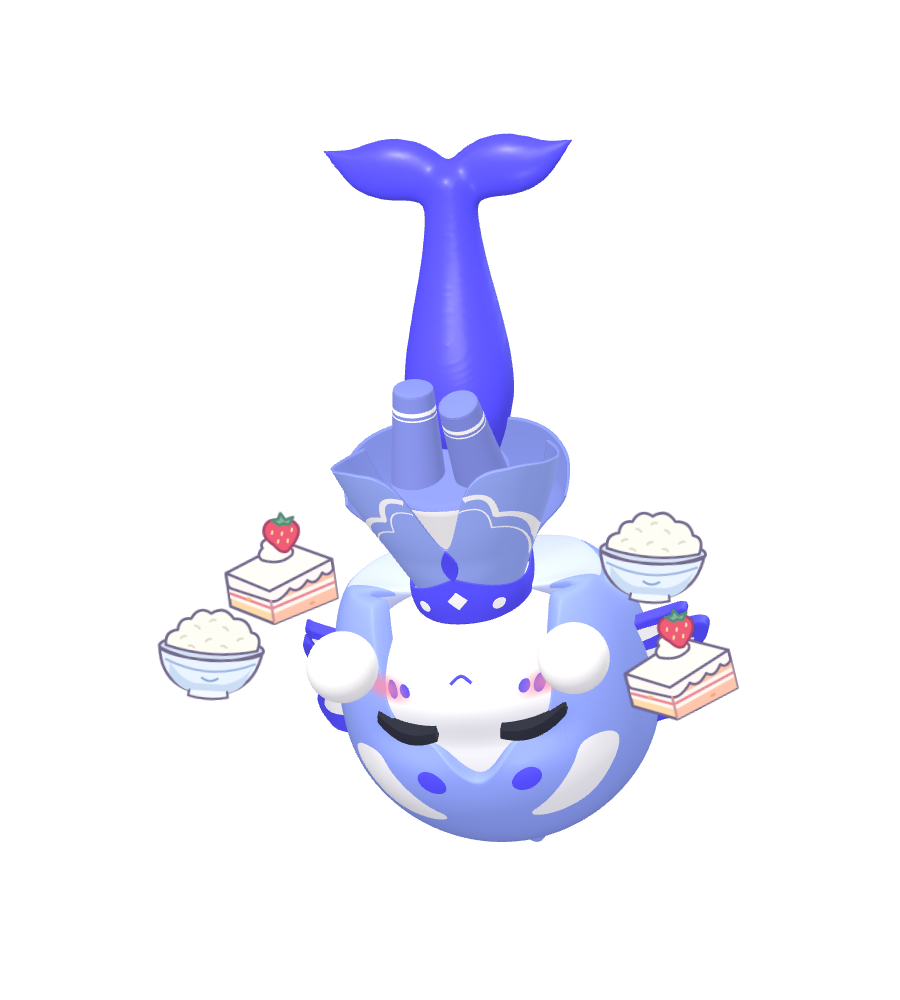

# 蓝色大肥鱼桌宠 1.2

使用荆棘定稿的蓝色大肥鱼模型制作的独立 Windows 桌宠：鲸尾、斗篷、悬浮圆手与害羞表情。

[下载 Windows 便携版](https://github.com/zirancanger-bit/blue-fat-fish/releases/latest)

## 打开

Windows 10 / 11，64 位。解压分享包，双击 `Blue-Fat-Fish-1.2.0-x64.exe`，首次启动稍等片刻。不用安装 Node.js，不需要浏览器或网络。

建议把 EXE 放进一个独立、可写的文件夹。便携版会在同一文件夹生成 `data`（设置）和 `photos`（照片）。关闭程序后，将整个文件夹移动到别的盘即可保留设置。与 Astra 桌宠的数据相互独立。

## 互动

- 单击头和身体：摸摸；连续抚摸 10 次会生气（每次间隔不超过 2 秒）。
- 单击圆手或鼻尖：害羞，低头收手、闭眼和脸红。
- 单击尾巴：快速连续拍地三次：第一下到第三下相隔 0.56 秒，动作和短音效同步。
- 双击：跳一下。按住拖动：尾巴顺势拉直，倒吊着搬走，身体和两只脚会晃动；松手会翻回来站稳。提起后晃动，会从两侧掉落白米饭和草莓蛋糕。小屋的“按住提尾巴”也能按住并移动鼠标预览。
- 右键：动作菜单。鼠标移到桌宠上后，点脚下的 `大肥鱼`：打开潮汐小屋。
- 潮汐小屋可以触发三连拍、害羞、挥手、跳跃、摇摆、小憩、叫醒、微笑、生气和散步；还可旋转查看、保存透明背景照片、设置专注计时。
- 眼芯颜色：在小屋或右键菜单选择浅紫色 / 红色，只改变眼睛内侧颜色，重启后保留。
- 音效默认开启，可在小屋或右键菜单关闭。自动散步默认关闭，按需开启。
- 在小屋关闭窗口仅关闭小屋。右键“退出桌宠”，或在小屋点“收工，回海里”可结束程序。

## 占用

待机限制刷新速度，小憩会进一步降低；关闭或最小化小屋可减少同时渲染。小屋提供“省电”画质和“轻一点的动作”，低配设备可以开启。

## 开发

需要 Node.js 22 或更新版本。使用 `npm ci` 安装开发依赖，然后 `npm start`。`npm test` 运行交互测试（先 `npm run build`）；`npm run package` 生成 Windows 便携程序。

角色设定：荆棘。建模与程序：Astra。运行时第三方许可见 THIRD_PARTY_NOTICES.md 和 licenses/。

## 1.1 更新

两只眼睛各自围绕中心缩小 1/12；眯眼眼线加粗，生气眼线按参考图重做；害羞红晕增强。拍尾巴改为一次蓄力、快速连续三拍；修正漫步朝向。新增眼芯颜色设置。

当前模型微调：眼下至脸颊的曲面过渡抹平；眼睛采用原始尺寸的 11/12；头部基础姿态上仰 5°，低头等动作在此基础上叠加。

## 1.2 更新

统一命名为“蓝色大肥鱼”。新增提尾巴倒吊、尾巴受力拉直、双脚错开晃动与松手复位；提起晃动时掉落 2D 白米饭和草莓蛋糕，大小约为圆手的 1.5 倍。粒子数量受限并自动淡出，“轻一点的动作”关闭食物掉落。微笑和害羞统一采用较深的红晕。

分享包包含程序、说明及许可证，不附带开发日志、私人存档或个人照片。已有便携版可在退出后保留 `data` 和 `photos` 文件夹，换用新 EXE。
